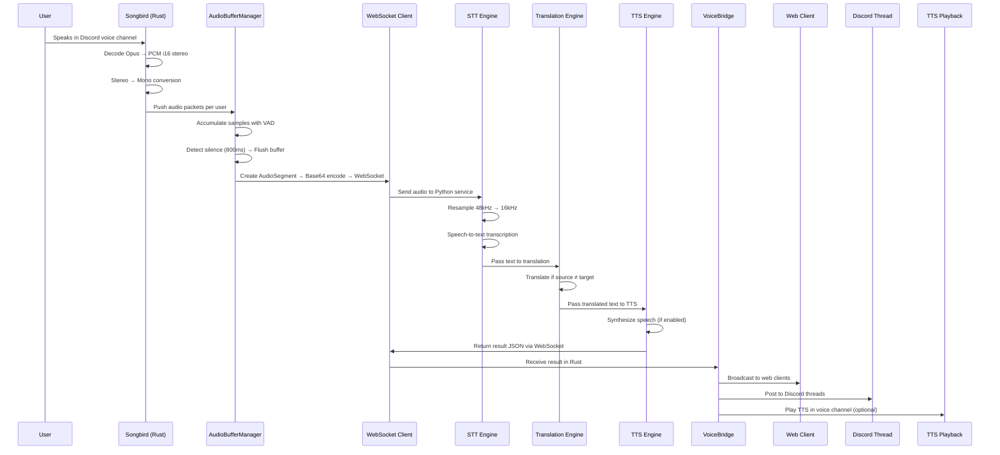

# LinguaBridge

Real-time Discord translation bot powered by Google's TranslateGemma models. Translates messages across 49+ languages with automatic language detection, web-based viewing, and per-user language preferences.

## Features

- **Real-time translation** - Automatically translates messages in configured channels
- **Voice channel translation** - Live speech-to-text, translation, and optional TTS playback
- **Voice Web View** - Browser-based real-time transcription with relative timestamps and TTS audio toggle
- **Discord Thread Transcripts** - Automatically post voice transcripts to language-specific threads
- **49+ languages** - Powered by Google's TranslateGemma (4B, 12B, or 27B parameters)
- **Automatic language detection** - No need to specify source language
- **User preferences** - Each user sets their preferred language
- **Secure provisioning** - Cryptographic admin transport protects API keys

---



## Quick Start

### Prerequisites

- Rust 1.75+ (`rustup install stable`)
- Python 3.10+ with pip
- NVIDIA GPU with 8GB+ VRAM (for 4B model) or CPU (slower)
- Discord bot token from [Discord Developer Portal](https://discord.com/developers/applications)

### Step 1: Clone and Build

```bash
git clone https://github.com/yourusername/linguabridge.git
cd linguabridge

# Build the Rust bot and admin CLI
cargo build --release
```

### Step 2: Set Up the Inference Service

```bash
cd inference

# Create virtual environment
python -m venv venv
source venv/bin/activate  # Windows: venv\Scripts\activate

# Install dependencies
pip install -r requirements.txt

# Start the inference server
DEVICE=cuda TRANSLATEGEMMA_MODEL=google/translategemma-4b-it python main.py
```

The inference service runs on `http://localhost:8000`. First startup downloads the model (~8GB for 4B).

### Step 3: Generate Admin Keys

In a new terminal:

```bash
cargo run -p admin-cli --release -- keygen
```

This creates two files:

- `admin.key` - Your private key (keep this secret!)
- `admin.pub` - Your public key (configure the bot with this)

### Step 4: Configure the Bot

Copy the example config:

```bash
cp .env.example .env
```

Edit `.env` and set your admin public key:

```bash
# Paste the contents of admin.pub here
LINGUABRIDGE_ADMIN__PUBLIC_KEY=your_base64_public_key_here
```

### Step 5: Start the Bot

```bash
cargo run --release
```

The bot will start and wait for provisioning. You'll see:

```sh
[INFO] LinguaBridge starting...
[INFO] Admin provisioning server listening on 0.0.0.0:9999
[INFO] Waiting for secrets to be provisioned...
```

### Step 6: Provision Your Discord Token

In another terminal, run:

```bash
cargo run -p admin-cli --release -- provision \
  --bot-url http://localhost:9999 \
  --discord-token "YOUR_DISCORD_BOT_TOKEN" \
  --admin-key admin.key
```

The bot will connect to Discord once provisioned:

```sh
[INFO] Secrets provisioned successfully!
[INFO] Starting Discord bot...
[INFO] Bot is ready!
```

---

## Discord Commands

Once the bot is running, use these slash commands in your Discord server:

### Server Setup (Admin)

| Command | Description |
|---------|-------------|
| `/setup init` | Initialize LinguaBridge for your server |
| `/setup channel #channel enable:true` | Enable translation in a text channel |
| `/setup languages en,es,fr` | Set target languages for the server |
| `/setup status` | View current configuration |

### Text Translation

| Command | Description |
|---------|-------------|
| `/translate text:Hello target:es` | Translate text to a specific language |
| `/languages` | List all supported languages |
| `/mylang es` | Set your preferred language |
| `/mypreferences` | View your current preferences |
| `/webview` | Get a link to the web translation viewer |

### Voice Translation

| Command | Description |
|---------|-------------|
| `/voice join [channel]` | Bot joins your voice channel (or specified channel) |
| `/voice leave` | Bot leaves the voice channel |
| `/voice status` | View voice translation status |
| `/voice url [channel]` | Get public web URL for viewing voice transcripts |
| `/voice transcript enable:true [text_channel] [languages]` | Enable transcript posting to Discord threads |
| `/voiceconfig language:es tts:true` | Configure voice channel settings |

### Initial Server Setup

1. Run `/setup init` as a server admin
2. Run `/setup channel #general enable:true` for each text channel to translate
3. Run `/setup languages en,es,fr,de` to set target languages
4. Users run `/mylang <code>` to set their preferred language

### Voice Channel Setup

1. Have the bot join your voice channel with `/voice join`
2. Get the web view URL with `/voice url` and share it with participants
3. Optionally enable Discord thread transcripts with `/voice transcript enable:true languages:en,es,fr`

---

## Supported Languages

LinguaBridge supports 49 languages including:

| Code | Language | Code | Language | Code | Language |
|------|----------|------|----------|------|----------|
| ar | Arabic | fr | French | pl | Polish |
| bn | Bengali | de | German | pt | Portuguese |
| bg | Bulgarian | el | Greek | pa | Punjabi |
| ca | Catalan | gu | Gujarati | ro | Romanian |
| zh | Chinese | he | Hebrew | ru | Russian |
| hr | Croatian | hi | Hindi | sr | Serbian |
| cs | Czech | hu | Hungarian | sk | Slovak |
| da | Danish | id | Indonesian | sl | Slovenian |
| nl | Dutch | it | Italian | es | Spanish |
| en | English | ja | Japanese | sv | Swedish |
| et | Estonian | kn | Kannada | ta | Tamil |
| fi | Finnish | ko | Korean | te | Telugu |
| | | lv | Latvian | th | Thai |
| | | lt | Lithuanian | tr | Turkish |
| | | mk | Macedonian | uk | Ukrainian |
| | | ms | Malay | ur | Urdu |
| | | ml | Malayalam | vi | Vietnamese |
| | | mr | Marathi | | |
| | | no | Norwegian | | |
| | | fa | Persian | | |

---

## Voice Web View (End Users)

The Voice Web View provides a browser-based interface for viewing real-time voice translations. Anyone with the URL can view transcriptions without needing Discord.

### Accessing the Web View

1. Ask a server moderator to run `/voice url` in Discord
2. Open the provided URL in any modern browser
3. The page connects automatically and displays live transcriptions

**URL Format:** `https://your-server.com/voice/{guild_id}/{channel_id}`

### Web View Features

- **Real-time transcriptions** - See what's being said as it happens
- **Relative timestamps** - "5 seconds ago", "1 minute ago" automatically updating
- **Speaker identification** - See who is speaking with color-coded names
- **Language badges** - Shows source and target language for each message (e.g., "ES → EN")
- **TTS audio toggle** - Listen to translated speech with play/pause/volume controls
- **Auto-reconnection** - Automatically reconnects if connection is lost

### TTS Audio Playback

The web view includes an audio player for TTS (text-to-speech) playback:

1. Click **Play** to start listening to translated audio
2. Audio messages are queued and played sequentially
3. Use the volume slider to adjust playback level
4. Click **Mute** to silence audio while keeping it queued

**Note:** TTS must be enabled on the server for audio to be available.

### Requirements

- Modern web browser (Chrome, Firefox, Safari, Edge)
- JavaScript enabled
- WebSocket support (all modern browsers)

---

## Discord Thread Transcripts (Moderators)

Moderators can configure the bot to post voice transcripts to Discord threads, creating a searchable archive of voice conversations.

### Setting Up Thread Transcripts

1. Join the voice channel you want to transcribe
2. Run the command:

   ```
   /voice transcript enable:true text_channel:#transcripts languages:en,es,fr
   ```

3. The bot creates threads for each language:
   - "Voice Translation - English"
   - "Voice Translation - Spanish"
   - "Voice Translation - French"

### Transcript Format

Messages appear in threads as:

```
**Username**
> Original text in source language
Translated text in target language
```

### Managing Transcripts

| Action | Command |
|--------|---------|
| Enable transcripts | `/voice transcript enable:true languages:en,es` |
| Disable transcripts | `/voice transcript enable:false` |
| Change text channel | `/voice transcript enable:true text_channel:#new-channel` |
| Add languages | Re-run the command with updated language list |

### Notes

- Threads are created in the specified text channel (or current channel if not specified)
- Each language gets its own thread for organized archives
- Threads auto-archive after 24 hours of inactivity (Discord default)
- Transcripts persist in Discord even if the bot goes offline

---

## Building & Publishing Docker Images

Before deploying to Akash or any container platform, you need to build and push the Docker images to a registry. LinguaBridge includes a release script that handles this for both GitHub Container Registry (GHCR) and Docker Hub, with full cross-architecture support.

### Prerequisites

1. **Docker** installed and running (with buildx for cross-platform builds)
2. **Registry accounts**:
   - [GitHub Container Registry](https://docs.github.com/en/packages/working-with-a-github-packages-registry/working-with-the-container-registry): Use your GitHub account
   - [Docker Hub](https://hub.docker.com/): Create a free account
3. **Authentication tokens**:
   - GHCR: [Personal Access Token](https://github.com/settings/tokens) with `write:packages` scope
   - Docker Hub: Your Docker Hub password or access token

### Using the Release Script

```bash
# Set the owner (your username OR organization name)
export GHCR_OWNER="your-org-or-username"
export DOCKERHUB_OWNER="your-org-or-username"

# Build and push to both registries with a version tag
./scripts/release.sh --tag v1.0.0 --all

# Or push to just one registry
./scripts/release.sh --tag v1.0.0 --ghcr
./scripts/release.sh --tag v1.0.0 --dockerhub

# Push to a GitHub organization (override via CLI)
./scripts/release.sh --tag v1.0.0 --ghcr --ghcr-owner my-organization

# Build only one image
./scripts/release.sh --tag v1.0.0 --bot-only --ghcr
./scripts/release.sh --tag v1.0.0 --inference-only --dockerhub
./scripts/release.sh --tag v1.0.0 --voice-only --ghcr

# Preview what would happen (dry run)
./scripts/release.sh --tag v1.0.0 --all --dry-run

# Push pre-built images without rebuilding (useful if build succeeded but push failed)
./scripts/release.sh --tag v1.0.0 --push-only --ghcr
```

**Note:** When pushing to an organization, you authenticate with your personal credentials, but the images are pushed to the organization's namespace. Ensure you have write access to the organization's packages.

### Cross-Architecture Builds

The release script supports building for different CPU architectures using Docker buildx. This is essential when building on Apple Silicon (arm64) for deployment on x86_64 servers (like most Akash providers).

```bash
# Build for amd64 only (default, typical for cloud deployments)
./scripts/release.sh --tag v1.0.0 --ghcr

# Build for your native architecture (auto-detected)
./scripts/release.sh --tag v1.0.0 --ghcr --native

# Build multi-architecture images (amd64 + arm64)
./scripts/release.sh --tag v1.0.0 --ghcr --multi

# Specify exact platforms
./scripts/release.sh --tag v1.0.0 --platform linux/amd64 --ghcr
./scripts/release.sh --tag v1.0.0 --platform linux/arm64 --ghcr
./scripts/release.sh --tag v1.0.0 --platform linux/amd64,linux/arm64 --ghcr
```

| Option | Description |
|--------|-------------|
| `--platform PLATFORMS` | Comma-separated list of platforms (e.g., `linux/amd64,linux/arm64`) |
| `--native` | Build only for your machine's native architecture |
| `--multi` | Build for both amd64 and arm64 |

**Architecture Notes:**

- **Default**: `linux/amd64` - Works on most cloud providers and Akash Network
- **Bot image**: Supports both `linux/amd64` and `linux/arm64`
- **Inference image**: Only supports `linux/amd64` (NVIDIA CUDA limitation)
- **Voice image**: Only supports `linux/amd64` (NVIDIA CUDA limitation)

When building on Apple Silicon for Akash deployment:

```bash
# Recommended: Build for amd64 (cross-compilation via buildx)
./scripts/release.sh --tag v1.0.0 --platform linux/amd64 --all
```

The script automatically sets up Docker buildx and handles cross-compilation. First cross-platform build may take longer as it pulls the buildx builder image.

### Manual Build (Alternative)

If you prefer to build manually:

```bash
# Build bot image
docker build -f docker/Dockerfile.rust -t linguabridge-bot:v1.0.0 .

# Build unified inference image (text + voice translation on single GPU)
docker build -f docker/Dockerfile.unified -t linguabridge-unified:v2.0.0 .

# Tag for GHCR (replace YOUR_ORG with your org or username)
docker tag linguabridge-bot:v1.0.0 ghcr.io/YOUR_ORG/linguabridge-bot:v1.0.0
docker tag linguabridge-unified:v2.0.0 ghcr.io/YOUR_ORG/linguabridge-unified:v2.0.0

# Login (use your personal username, even for org pushes)
docker login ghcr.io -u YOUR_USERNAME

# Push to org namespace
docker push ghcr.io/YOUR_ORG/linguabridge-bot:v1.0.0
docker push ghcr.io/YOUR_ORG/linguabridge-unified:v2.0.0
```

### Update deploy.yaml

After pushing, update `deploy.yaml` with your image references:

```yaml
services:
  inference:
    image: ghcr.io/YOUR_ORG/linguabridge-unified:v2.0.0
  bot:
    image: ghcr.io/YOUR_ORG/linguabridge-bot:v1.0.0
```

---

## Docker Deployment

### Local Development with Docker Compose

```bash
cd docker

# Set your admin public key
export ADMIN_PUBLIC_KEY="your_base64_public_key_here"

# Build and start
docker compose up -d
```

### Provision the Running Container

```bash
# From your local machine with the admin.key file
cargo run -p admin-cli --release -- provision \
  --bot-url http://your-server:9999 \
  --discord-token "YOUR_DISCORD_BOT_TOKEN" \
  --admin-key admin.key
```

### Akash Network Deployment

LinguaBridge includes an Akash SDL file (`deploy.yaml`) for decentralized deployment. The secure admin provisioning system ensures your Discord token and API keys are never exposed to Akash providers.

**Quick Setup:** Run the interactive configuration wizard to generate a ready-to-deploy SDL:

```bash
./scripts/configure-deploy.sh
```

This walks you through setting up GHCR credentials, admin keys, and image references, then generates `deploy-configured.yaml`.

#### Step 1: Prepare for Deployment

```bash
# Generate your admin keypair
cargo run -p admin-cli --release -- keygen

# Note the public key from admin.pub - you'll need it
cat admin.pub
```

#### Step 2: Configure the SDL

Edit `deploy.yaml`:

1. Replace `<YOUR_ADMIN_PUBLIC_KEY>` with your admin public key
2. Update the Docker image URLs to your registry
3. Optionally customize resource allocations

#### Step 3: Deploy to Akash

```bash
# Using Akash CLI
akash tx deployment create deploy.yaml --from your-wallet

# Or use Akash Console (https://console.akash.network)
# Upload deploy.yaml and follow the guided deployment
```

#### Step 4: Provision After Deployment

Once deployed, note the assigned URI from Akash, then:

```bash
cargo run -p admin-cli --release -- provision \
  --bot-url https://<your-akash-uri>:9999 \
  --discord-token "YOUR_DISCORD_BOT_TOKEN" \
  --admin-key admin.key
```

#### Security Model

The provisioning uses:

- Ed25519 signatures to verify admin identity
- X25519 key exchange for forward secrecy
- ChaCha20-Poly1305 authenticated encryption
- Memory-only storage (secrets never written to disk)

This ensures that even Akash providers with access to your container cannot extract sensitive credentials.

---

## Configuration Reference

### Environment Variables

| Variable | Default | Description |
|----------|---------|-------------|
| `LINGUABRIDGE_ADMIN__PUBLIC_KEY` | (required) | Admin Ed25519 public key (base64) |
| `LINGUABRIDGE_ADMIN__PORT` | `9999` | Admin provisioning endpoint port |
| `LINGUABRIDGE_INFERENCE__URL` | `http://localhost:8000` | Inference service URL |
| `LINGUABRIDGE_INFERENCE__MODEL` | `google/translategemma-4b-it` | TranslateGemma model |
| `LINGUABRIDGE_WEB__PORT` | `3000` | Web server port |
| `LINGUABRIDGE_WEB__PUBLIC_URL` | `http://localhost:3000` | Public URL for links |
| `LINGUABRIDGE_DATABASE__URL` | `sqlite://linguabridge.db` | Database connection |
| `LINGUABRIDGE_VOICE__URL` | `ws://inference:8000/voice` | Voice inference WebSocket |
| `LINGUABRIDGE_VOICE__ENABLE_TTS_PLAYBACK` | `false` | Play TTS in Discord voice |
| `LINGUABRIDGE_VOICE__BUFFER_MS` | `500` | Audio buffer size (ms) |
| `LINGUABRIDGE_VOICE__VAD_THRESHOLD` | `0.5` | VAD sensitivity (0.0-1.0) |
| `LINGUABRIDGE_VOICE__DEFAULT_TARGET_LANGUAGE` | `en` | Default voice target language |
| `RUST_LOG` | `linguabridge=info` | Log level |

### Model Selection

| Model | VRAM Required | Speed | Quality |
|-------|---------------|-------|---------|
| `google/translategemma-4b-it` | ~8GB | Fast | Good |
| `google/translategemma-12b-it` | ~24GB | Medium | Better |
| `google/translategemma-27b-it` | ~54GB | Slower | Best |

### Unified Inference Service

The unified inference service combines text and voice translation on a single GPU:

| Variable | Default | Description |
|----------|---------|-------------|
| `DEVICE` | `cuda` | Compute device (cuda/cpu) |
| `TRANSLATEGEMMA_MODEL` | `google/translategemma-4b-it` | Translation model |
| `STT_MODEL` | `distil-large-v3` | Whisper model for speech-to-text |
| `TTS_MODEL` | `CosyVoice2-0.5B` | Model for text-to-speech |
| `ENABLE_STT` | `true` | Enable speech-to-text |
| `ENABLE_TTS` | `true` | Enable TTS synthesis |
| `ENABLE_DIARIZATION` | `false` | Speaker diarization (requires HF token) |
| `HF_TOKEN` | (optional) | HuggingFace token for pyannote models |
| `HOST` | `0.0.0.0` | Service bind address |
| `PORT` | `8000` | Service port |

**Resource Requirements:**

| Service | VRAM | RAM | Notes |
|---------|------|-----|-------|
| Unified Inference | ~24-32GB | 32GB | Translation + STT + TTS models on single GPU |

---

## Admin CLI Reference

The admin CLI (`linguabridge-admin`) manages secure provisioning.

### Generate Keypair

```bash
linguabridge-admin keygen [--output-dir ./keys]
```

Creates `admin.key` (private) and `admin.pub` (public).

### Provision Bot

```bash
linguabridge-admin provision \
  --bot-url http://localhost:9999 \
  --discord-token "token" \
  --admin-key admin.key \
  [--hf-token "optional_huggingface_token"] \
  [--custom KEY=VALUE ...]
```

### Check Status

```bash
linguabridge-admin status --bot-url http://localhost:9999
```

### Display Public Key

```bash
linguabridge-admin pubkey --admin-key admin.key
```

---

## Troubleshooting

### Bot won't start

**"Admin public key must be configured"**

Set the `LINGUABRIDGE_ADMIN__PUBLIC_KEY` environment variable to your admin public key (from `admin.pub`).

**"Waiting for secrets to be provisioned..."**

The bot is waiting for you to run the `provision` command with your Discord token.

### Inference service issues

**"CUDA out of memory"**

Use a smaller model or run on CPU:

```bash
DEVICE=cpu python main.py
```

**Model download fails**

Check your Hugging Face access. Some models may require accepting terms:

1. Visit <https://huggingface.co/google/translategemma-4b-it>
2. Accept the license
3. Set `HF_TOKEN` environment variable if needed

### Provisioning fails

**"Invalid signature"**

Make sure you're using the correct admin.key file that matches the public key configured in the bot.

**"Already provisioned"**

The bot only accepts provisioning once per restart. Restart the bot to re-provision.

### Voice translation issues

**Bot doesn't join voice channel**

Ensure the bot has Connect and Speak permissions in the voice channel. Check that `GUILD_VOICE_STATES` intent is enabled.

**No transcription appearing**

1. Check unified inference service is running: `curl http://localhost:8000/health`
2. Verify `LINGUABRIDGE_VOICE__URL` points to the correct WebSocket endpoint (`ws://inference:8000/voice`)
3. Check bot logs for "Failed to send audio to inference" errors

**Voice models fail to load**

For speaker diarization, you need a HuggingFace token with pyannote license accepted:

1. Visit <https://huggingface.co/pyannote/speaker-diarization-3.1>
2. Accept the license
3. Set `HF_TOKEN` environment variable

---

## Architecture

```
                                      +------------------+
                                      |   Discord API    |
                                      +--------+---------+
                                               |
                                               | (messages + voice)
  +----------------+                  +--------+---------+
  |  Admin CLI     |  provision -->  |  LinguaBridge    |
  | (local machine)|                 |  (Rust binary)   |
  +----------------+                 +--------+---------+
                                              |
                      +-----------------------+------------------------+
                      |                       |                        |
             +------------------------+    +---------+--------+
             | Unified Inference      |    |   Web Server     |
             | (Python/FastAPI+WS)    |    |   (Axum)         |
             | Port 8000 (REST+WS)    |    |   Port 3000      |
             | Text + Voice on 1 GPU  |    |                  |
             +------------------------+    +--------+---------+
                                                                      |
                                              +-----------------------+
                                              |                       |
                                    +---------+--------+    +---------+---------+
                                    | Text Web View    |    | Voice Web View    |
                                    | /view/{session}  |    | /voice/{g}/{c}    |
                                    | (session-based)  |    | (public access)   |
                                    +------------------+    +-------------------+
                                                                      |
                                                            +---------+---------+
                                                            | Discord Threads   |
                                                            | (per-language     |
                                                            |  transcripts)     |
                                                            +-------------------+
```

### Web Routes

| Route | Access | Purpose |
|-------|--------|---------|
| `/view/{session_id}` | Session-based | Text channel translation viewer |
| `/voice/{guild_id}/{channel_id}` | Public | Voice channel transcription viewer |
| `/voice/{guild_id}/{channel_id}/ws` | WebSocket | Real-time voice transcription stream |
| `/health` | Public | Health check endpoint |
| `/api/session/{session_id}` | Public | Session info API |

---

## Security Model

LinguaBridge uses a cryptographic provisioning system to protect sensitive credentials:

1. **Key Generation**: Admin generates an Ed25519 keypair locally
2. **Trust Anchor**: Only the public key is deployed with the bot
3. **Secure Channel**: Provisioning uses X25519 key exchange + ChaCha20-Poly1305
4. **Forward Secrecy**: Bot generates ephemeral keys on each restart
5. **Memory Only**: Secrets are never written to disk and zeroized on drop

This design ensures that even if an attacker gains access to the running container or deployment configuration, they cannot extract the Discord token or other secrets without the admin's private key.

---

## Web Viewer Architecture

The web views use [Askama](https://github.com/djc/askama) templates with static CSS/JS files, giving proper separation of concerns while keeping the app predominantly Rust.

```
templates/                  ← Askama templates (compiled into the binary, type-checked)
  web_view.html             ← Text channel translation viewer
  voice_view.html           ← Voice channel transcription viewer
static/                     ← Runtime-served files (editable without recompiling)
  css/
    common.css              ← Shared Discord-themed variables & base styles
    web_view.css            ← Text view styles
    voice_view.css          ← Voice view styles (audio controls, speaker avatars)
  js/
    websocket.js            ← Shared WebSocket connection with exponential backoff
    web_view.js             ← Text message rendering + DOM management
    voice_view.js           ← Voice messages + TTS audio queue
  index.html                ← Landing page
```

### How it works

1. **Askama templates** define the HTML structure and reference static assets via `<link>` / `<script src>`
2. **Dynamic config** (session IDs, WebSocket URLs) is injected by Askama into a `window.__CONFIG` object
3. **Static JS** reads `window.__CONFIG` at runtime — no inline scripts in the template
4. **CSS/JS edits** take effect immediately (served by `tower_http::ServeDir`) — no Rust recompile needed
5. **Template edits** (HTML structure) are validated at compile time by Askama

### Modifying the views

- **Styling**: Edit files in `static/css/`. Changes are live on next page load.
- **Behavior**: Edit files in `static/js/`. The shared `websocket.js` provides `createWebSocket(url, { onMessage, onStatusChange })`.
- **Structure**: Edit `templates/*.html`. Run `cargo chec` to verify template variables match the Rust struct.
- **New template variables**: Update the corresponding struct in `src/web/routes.rs` or `src/web/voice_routes.rs`.

---

## Development

### Running Tests

```bash
cargo test
```

### Local Development Setup

Terminal 1 - Inference:

```bash
cd inference && python main.py
```

Terminal 2 - Bot:

```bash
cargo run
```

Terminal 3 - Provision:

```bash
cargo run -p admin-cli -- provision --bot-url http://localhost:9999 --discord-token $DISCORD_TOKEN --admin-key admin.key
```

---

## License

MIT

---

<!-- AGENTIC CONTEXT -->
<!-- The following section provides structured information for AI assistants -->

## Agentic Context

This section provides technical details for AI agents working with this codebase.

### Project Structure

```
linguabridge/
├── Cargo.toml              # Workspace root with crypto dependencies
├── admin-cli/              # Secure provisioning CLI tool
│   ├── Cargo.toml
│   └── src/main.rs         # keygen, provision, status, pubkey commands
├── src/
│   ├── main.rs             # Entry point with provisioning wait loop
│   ├── lib.rs              # Library exports
│   ├── config.rs           # Configuration with AdminConfig
│   ├── admin/              # Secure admin transport layer
│   │   ├── mod.rs          # Module exports
│   │   ├── crypto.rs       # Ed25519/X25519/ChaCha20 primitives
│   │   ├── secrets.rs      # In-memory SecretStore with zeroize
│   │   └── transport.rs    # Axum routes for /pubkey, /status, /provision
│   ├── bot/                # Discord bot (serenity/poise)
│   │   ├── mod.rs          # Bot setup with start_bot_with_token()
│   │   ├── handler.rs      # Message event handler
│   │   └── commands/       # Slash commands (setup, translate, mylang, webview, voice)
│   ├── voice/              # Voice translation pipeline
│   │   ├── mod.rs          # VoiceManager exports
│   │   ├── bridge.rs       # Bridges voice results to web/Discord threads
│   │   ├── handler.rs      # Songbird audio receiver
│   │   ├── buffer.rs       # Per-user audio buffers with VAD
│   │   ├── client.rs       # WebSocket client for inference
│   │   ├── playback.rs     # TTS playback to Discord
│   │   └── types.rs        # AudioPacket, AudioSegment, WebSocket messages
│   ├── web/                # Web server (axum)
│   │   ├── mod.rs          # Server setup
│   │   ├── routes.rs       # HTTP routes + text web view
│   │   ├── voice_routes.rs # Voice web view routes (/voice/{g}/{c})
│   │   ├── broadcast.rs    # WebSocket broadcast manager
│   │   └── websocket.rs    # WebSocket for live translations
│   ├── db/                 # Database layer (sqlx/sqlite)
│   │   ├── mod.rs          # Pool and repos
│   │   ├── models.rs       # Guild, User, Session, VoiceTranscript models
│   │   └── queries.rs      # Database queries and migrations
│   └── translation/        # Translation client
│       ├── mod.rs          # TranslationClient
│       └── cache.rs        # LRU translation cache
├── inference/              # Python inference sidecar
│   ├── main.py             # FastAPI server (text translation)
│   ├── translator.py       # TranslateGemma wrapper
│   ├── detector.py         # Language detection
│   ├── voice_service.py    # WebSocket server (voice translation)
│   ├── voice/              # Voice processing modules
│   │   ├── stt.py          # Distil-Whisper speech-to-text
│   │   └── tts.py          # CosyVoice/edge-tts text-to-speech
│   └── requirements.txt    # Python dependencies
├── docker/
│   ├── docker-compose.yml  # Multi-container deployment
│   ├── Dockerfile.rust     # Bot container
│   └── Dockerfile.unified  # Unified inference container (text + voice)
├── config/
│   └── default.toml        # Default configuration
├── templates/              # Askama HTML templates (compiled into binary)
│   ├── web_view.html       # Text channel translation viewer
│   └── voice_view.html     # Voice channel transcription viewer
└── static/                 # Runtime-served web assets
    ├── index.html          # Landing page
    ├── css/
    │   ├── common.css      # Shared Discord-themed styles
    │   ├── web_view.css    # Text view styles
    │   └── voice_view.css  # Voice view styles
    └── js/
        ├── websocket.js    # Shared WebSocket with reconnect
        ├── web_view.js     # Text message rendering
        └── voice_view.js   # Voice messages + TTS audio queue
```

### Key Technical Decisions

1. **Python sidecar for inference**: Candle (Rust ML) doesn't support Gemma 3 architecture yet. Python sidecar uses transformers library.

2. **Unified inference service**: Text and voice translation share a single GPU, loading TranslateGemma once in memory. The unified service exposes both REST (text translation) and WebSocket (voice translation) endpoints, reducing deployment complexity and GPU costs.

3. **Secure admin transport**: Environment variables expose secrets on decentralized platforms (Akash). Cryptographic provisioning solves this:
   - Ed25519 for admin authentication
   - X25519 for ephemeral key exchange
   - ChaCha20-Poly1305 for payload encryption
   - zeroize for secure memory cleanup

4. **Memory-only secrets**: SecretsPayload uses manual Drop impl to zeroize all fields. Never persisted to disk.

5. **Songbird for voice**: The bot uses Songbird (serenity voice integration) for receiving Discord voice audio. Energy-based VAD segments speech into utterances before sending to inference.

6. **Boot sequence**: main.rs waits for provisioning before starting Discord bot:

   ```rust
   // 1. Load config (no secrets)
   // 2. Start admin server on port 9999
   // 3. Wait for secrets via secret_store.wait_for_provisioning()
   // 4. Start Discord bot with token from SecretStore
   ```

### Important Files for Modifications

- **Adding new bot commands**: `src/bot/commands/mod.rs` + new command file
- **Adding new secrets**: Update `SecretsPayload` in both `src/admin/secrets.rs` and `admin-cli/src/main.rs`
- **Changing config**: `src/config.rs` and `config/default.toml`
- **Database schema**: `src/db/models.rs` for types, `src/db/queries.rs` for migrations + repos
- **Web view UI**: `templates/` (HTML), `static/css/` (styles), `static/js/` (behavior), Rust structs in `src/web/routes.rs` and `src/web/voice_routes.rs`
- **Voice result handling**: `src/voice/bridge.rs` routes results to web clients + Discord threads
- **Discord thread transcripts**: `src/bot/commands/voice.rs` (transcript command) + `src/db/queries.rs` (VoiceTranscriptRepo)

### Crypto Implementation Details

Location: `src/admin/crypto.rs`

```rust
// Key types
EphemeralKeyPair          // X25519 session keys (regenerated on boot)
SigningKey / VerifyingKey // Ed25519 admin identity

// Functions
verify_signature()        // Verify admin Ed25519 signature
decrypt_payload()         // X25519 ECDH + ChaCha20-Poly1305
encrypt_payload()         // For responses (admin CLI uses this)
build_signature_message() // Canonical message format for signing
```

### Provisioning Protocol

1. Admin CLI calls `GET /pubkey` to get bot's ephemeral X25519 public key
2. CLI generates ephemeral X25519 keypair
3. CLI computes shared secret via ECDH
4. CLI encrypts secrets with ChaCha20-Poly1305
5. CLI signs (bot_pubkey || cli_pubkey || ciphertext || nonce) with Ed25519
6. CLI sends `POST /provision` with signature + encrypted payload
7. Bot verifies signature against configured admin public key
8. Bot decrypts payload and stores in SecretStore
9. Bot notifies waiters and starts Discord connection

### Dependencies

Key crates:

- `serenity` / `poise` - Discord bot framework
- `songbird` - Discord voice reception
- `axum` - Web server
- `sqlx` - Async database
- `tokio-tungstenite` - WebSocket client
- `ed25519-dalek` - Ed25519 signatures
- `x25519-dalek` - X25519 key exchange
- `chacha20poly1305` - AEAD encryption
- `zeroize` - Secure memory cleanup

Key Python packages (voice):

- `faster-whisper` - Distil-Whisper STT
- `cosyvoice` - CosyVoice TTS (optional)
- `edge-tts` - Microsoft Edge TTS (fallback)
- `pyannote.audio` - Speaker diarization (optional)

### Common Tasks

**Run the full stack locally:**

```bash
# Terminal 1: Unified Inference (text + voice)
cd inference && python unified_inference.py

# Terminal 2: Bot
cargo run

# Terminal 3: Provision
cargo run -p admin-cli -- provision --bot-url http://localhost:9999 --discord-token $TOKEN --admin-key admin.key
```

**Check if bot is provisioned:**

```bash
curl http://localhost:9999/status
# {"status":"waiting_for_provisioning"} or {"status":"provisioned"}
```

**Get bot's ephemeral public key:**

```bash
curl http://localhost:9999/pubkey
# {"public_key":"base64..."}
```

**Check unified inference service:**

```bash
curl http://localhost:8000/health
# {"status":"ok","model_loaded":true,"stt_loaded":true,"tts_loaded":true,...}
```

**Test voice web view locally:**

```bash
# Open in browser (replace with actual guild/channel IDs)
open http://localhost:3000/voice/123456789/987654321

# Or test WebSocket connection directly
websocat ws://localhost:3000/voice/123456789/987654321/ws
```

**Check voice transcript settings in database:**

```bash
sqlite3 linguabridge.db "SELECT * FROM voice_transcript_settings;"
```

## RESEARCH

- <https://github.com/Discord-TTS/Bot>
- <https://github.com/yewstack/yew>
